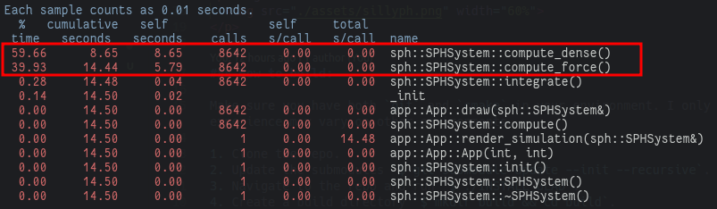

### SillyPH (Silly Particle Hydrodynamics)

It's a simple attempt to rewrite my bachelor thesis on C++ on CPU only. Though, I am hoping to optimise it somehow in the future.
Hence, it's a living repo and I will start with very simple things: To make the app physical properties works, and leave performance behind.

  

### How to build:

Make sure you have both `git` and `cmake` in your environment. I only tested this in Ubuntu 22.04 so your experience may vary on other environments.

1. Clone the repo.
2. Update the submodules `$ git submodule update --init --recursive`.
3. Navigate to the repo and run `$ ./INSTALL_GLAD`.
4. Create a build directory `$ mkdir build && cd build`.
5. Run CMake `$ cmake .. -G "Unix Makefiles" -DCMAKE_BUILD_TYPE=Debug|Release`. Use *Debug* for debugging and *Release* for optimized binary.
6. Build `$ make`.

### Performance:

Currently, finding neighbors (used in **[SPHSystem::compute_dense][3]** and **[SPHSystem::compute_force][4]**) takes $O(n^2)$. This should be part to optimize by having neighbor set initialised. Hence, during iterations no need to find neighboring particles for all *N* particles. Ultimately, these can also be parallelly exploited and run as GPU code (e.g. CUDA). That I will probably add in the future.

Profiling the application indeed shows both functions took all the blame for most % of execution time.

### References:

There are already plenty of available source codes online which has more sophisticate optimizations here and there. But I do recommend that you starts from here these two:

* [Mueller SPH][1]
* Surface rendering of the spheres (not implemented). [Marching Cubes Rendering][2]

[1]: https://matthias-research.github.io/pages/publications/sca03.pdf

[2]: https://en.wikipedia.org/wiki/Marching_cubes

[3]: https://github.com/yanuartadityan/sillyph/blob/main/sph/sph_particle.cpp#L50

[4]: https://github.com/yanuartadityan/sillyph/blob/main/sph/sph_particle.cpp#L64